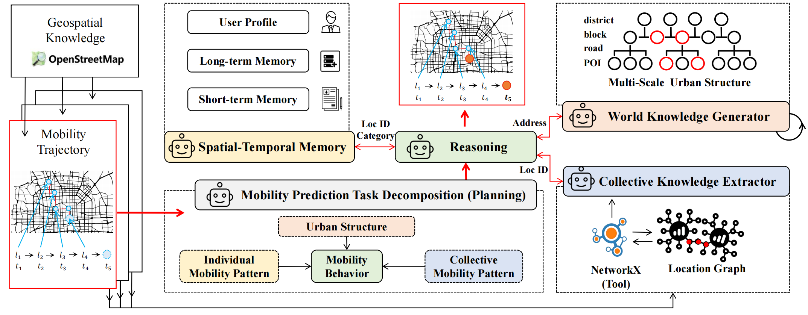

# 🤖 AgentMove
AgentMove: A Large Language Model based Agentic Framework for Zero-shot Next Location Prediction

# 📰 News
- 2025.02 We have uploaded a new version of the AgentMove paper! [Check it out here](https://arxiv.org/abs/2408.13986)!
- 2025.01 Our paper has been accepted to [NAACL 2025](https://aclanthology.org/2025.naacl-long.61/) as a main conference paper!

# 🌍 Introduction
Next location prediction plays a crucial role in various real-world applications. Recently, due to the limitation of existing deep learning methods, attempts have been made to apply large language models (LLMs) to zero-shot next location prediction task. However, they directly generate the final output using LLMs without systematic design, which limits the potential of LLMs to uncover complex mobility patterns and underestimates their extensive reserve of global geospatial knowledge. In this paper, we introduce \textbf{AgentMove}, a systematic agentic prediction framework to achieve generalized next location prediction. 
In AgentMove, we first decompose the mobility prediction task and design specific modules to complete them, including spatial-temporal memory for individual mobility pattern mining, world knowledge generator for modeling the effects of urban structure and collective knowledge extractor for capturing the shared patterns among population. Finally, we combine the results of three modules and conduct a reasoning step to generate the final predictions. 
Extensive experiments utilizing mobility data from two distinct sources reveal that AgentMove surpasses the leading baseline by 3.33\% to 8.57\% across 8 out of 12 metrics and it shows robust predictions with various LLMs as base and also less geographical bias across cities.



# ⌨️ Repo Structure
```
- agent.py                      # Main entry point
    - run_fsq.sh                # Example script
    - run_isp.sh                # Example script
- config.py                     # Parameter configuration
- processing                    # Raw data processing code; see [README](./scripts/README.md) for details
    - process_fsq_city_data.py  # Parses city trajectory data from raw global Foursquare check-in data, including only location coordinates, ID, and category
    - process_isp_shanghai.py   # Processes raw ISP data and matches it with the Foursquare data format for unified handling later
    - osm_address_deploy.py     # Given location coordinates, retrieves nearby addresses using a self-deployed address resolution service for large-scale parallel processing, https://github.com/mediagis/nominatim-docker/tree/master/4.4  
    - osm_address_web.py        # Given location coordinates, retrieves nearby addresses using the official address resolution service, suitable for small-scale testing
    - trajectory_address_match.py  # Uses various address services and GPT to match a unified four-level address structure, expanding trajectory points with new four-level address information
    - data.py                   # Final preprocessing functions for the data; no need to call manually, will be invoked automatically by the agent
    - download.py               # Downloads raw datasets
- models
    - personal_memory.py        # Implementation related to the memory module
    - world_model.py            # Implementation related to the world model
    - prompts.py                # Prompt templates for LLM-based baselines and AgentMove
    - llm_api.py                # Unified entry point for all LLM APIs from various providers
- evaluate
    - evaluations.py            # Statistics for evaluating a single model
    - analysis.py               # Calls evaluations.py to analyze and compare multiple models simultaneously and saves the results in results/summary
- serving/*                     # Local deployment of LLMs; we use powerful vLLM for local deployment
- baselines/*                   # Implementations of baseline algorithms; we use the official implementations
- utils.py
- assets/*                      # Assets
```

# 💡 Running Experiments

## LLM API Key
Configure the relevant API keys in `.bashrc`, then execute `source .bashrc`:

```bash
# Provide free tokens for many 7B models
export SiliconFlow_API_KEY="xx"

# The following APIs may require a proxy
export DeepInfra_API_KEY="xx"
export OpenAI_API_KEY="xx"

# You can also deploy the model locally via vLLM
export vllm_KEY="xx"

# Set Nominatim server address if you deploy it locally
export nominatim_deploy_server_address="IP:Port"
```

We define the list of supported models in `models/llm_api.py`. You can add new models or platforms by modifying this file.

## Installation
```bash
git clone https://github.com/tsinghua-fib-lab/AgentMove.git  

cd AgentMove

conda create -n agentmove python=3.10
pip install -r requirements.txt
```

## Preprocessing
```bash
# Step 1: Define the city collection in config.py using EXP_CITIES
EXP_CITIES = ["Shanghai"]  # for WWW 2019 ISP
# EXP_CITIES = ['Tokyo', 'Nairobi', 'NewYork', 'Sydney', 'CapeTown', 'Paris', 'Beijing', 'Mumbai', 'SanFrancisco', 'London', 'SaoPaulo', 'Moscow']  # for TIST 2015

# Step 2: Download data (tist2015 used in paper, www2019 used in paper)
# The www2019 dataset is already uploaded in the data folder
python -m processing.download --data_name=www2019

# Step 3:
# Processing Foursquare data (tist2015, gowalla)
# python -m processing.process_fsq_city_data

# Processing IPS GPS trajectory data (www2019)
python -m processing.process_isp_shanghai

# Step 4: Get OpenStreetMap addresses
# A local Nominatim service must be deployed before executing these commands.
# Alternatively, you may utilize the official Nominatim API
python -m processing.osm_address_deploy
# python -m processing.osm_address_web

# Step 5: Match trajectory with address
python -m processing.trajectory_address_match
```

## Running and Evaluation
### Agent Execution
```bash
python -m agent --sample_one_traj_of_user \
    --social_info_type=address \
    --traj_min_len=3 \
    --traj_max_len=50 \
    --city_name=Beijing \
    --prompt_num=50 \
    --workers=20 \
    --exp_name=test \
    --prompt_type=agent_move_v6 \
    --model_name=llama4-17b \
    --platform=DeepInfra
```

### Evaluation
```bash
python -m evaluate.analysis --eval_path=results/20240505/ --level=city
python -m evaluate.analysis --eval_path=results/20240505/Beijing/agentmove/ --level=agent
python -m evaluate.analysis --eval_path=results/20240505/Beijing/agentmove/llama3-8b/ --level=llm
python -m evaluate.analysis --eval_path=results/20240505/Beijing/agentmove/llama3-8b/agent_move_v6/ --level=prompt
```

### More Running Examples
```bash
./run_fsq.sh
./run_isp.sh
```

# 🔧 Debugging Tips
1. If you encounter any exceptions, you can try relaxing the try-except control in the code to help with debugging.
2. You can refer to the `launch.json` file in the `.vscode` directory to enable remote debugging.

# ✅ TODO List
- [ ] Update LLM support, e.g., adding "qwen2.5" and "deepseek", support for openrouter platform
- [ ] Add new baselines, e.g., "Taming the Long Tail in Human Mobility Prediction"
- [ ] Add new datasets, e.g., "YJMob100K"

# 🌟 Citation

If you find this work helpful, please cite our paper:

```latex
@inproceedings{feng2025agentmove,
  title={Agentmove: A large language model based agentic framework for zero-shot next location prediction},
  author={Feng, Jie and Du, Yuwei and Zhao, Jie and Li, Yong},
  booktitle={Proceedings of the 2025 Conference of the Nations of the Americas Chapter of the Association for Computational Linguistics: Human Language Technologies (Volume 1: Long Papers)},
  pages={1322--1338},
  year={2025}
}
```

# 👏 Acknowledgement

We greatly appreciate the following GitHub repositories for their valuable code and efforts:
- https://github.com/ssai-trento/LLM-zero-shot-NL — for the initial code structure
- https://github.com/vonfeng/DPLink — for the ISP data
- https://github.com/LibCity/Bigscity-LibCity — for the baselines
- https://github.com/songyangme/GETNext  
- https://github.com/ant-research/Spatio-Temporal-Hypergraph-Model  

# 📩 Contact

If you have any questions or want to use the code, feel free to contact:
Jie Feng (fengjie@tsinghua.edu.cn)
